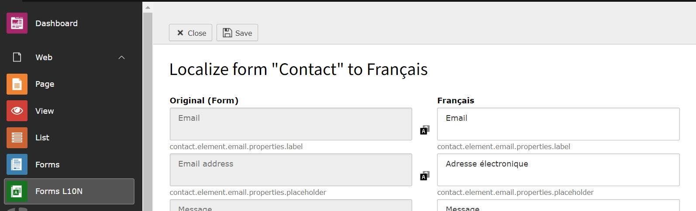

[](https://extensions.typo3.org/extension/form_translator/)
[](https://get.typo3.org/version/12)
[](https://get.typo3.org/version/11)
[](https://packagist.org/packages/r3h6/form-translator)
[](https://packagist.org/packages/form-translater)

# form_translator

This extension provides a backend module for translating TYPO3 form framework forms
and a cli for creating a source xliff file for a given form.




## Installation

Either from TYPO3 TER or through composer `$ composer req r3h6/form-translator`.


## Integration

If you like use machine translation by [LibreTranslate](https://libretranslate.com/)
you must only configure an api host in the extension configuration.
See available [mirrors](https://github.com/LibreTranslate/LibreTranslate#mirrors).


## How it works

The extensions adds a translation file path to the *.form.yaml file when localize through the backend module.
```yaml
# example.form.yaml
renderingOptions:
  translation:
    translationFiles:
      99: fileadmin/form_definitions/l10n/example.xlf
```

Customized validation error messages are translated by overriding the form definition
at runtime using the `afterBuildingFinished` hook from the form framework.


## Upgrade

### From v2 an TYPO3 v12

Rename language files prefixed with a locale like `de_DE.locallang.xlf`
to the corresponding TYPO3 language `de.locallang.xlf`
or setup a [custom language](https://docs.typo3.org/m/typo3/reference-coreapi/main/en-us/ApiOverview/Localization/ManagingTranslations.html#xliff-translating-languages).

### From v2 an TYPO3 v11

No changes required.


## Known issues

- [Issues on GitHub](https://github.com/r3h6/TYPO3.EXT.form_translator/issues)

### Transalte to English overrides the original form labels

**Scenario:** German is used as default language and your form definition labels are in German too.

When you translate a form to English, English will override your original labels even on the German version of your site.<br>
You have following options:

1. Create a (duplicated) German translation of the form
2. Add the English locale without charset to the extension configuration `typo3LanguageWhitelist`

**Background:** Beginning with v12, TYPO3 uses the locale configured for the site to determine the language.<br>
For English, TYPO3 uses the file named `xyz.xlf`, it does not load a file named `en.xyz.xlf`, but it does for `en_US.xyz.xlf`.


## Resources

- [Tutorial by Sebastian Klein](https://www.sebkln.de/en/tutorials/translating-forms-in-the-typo3-form-framework/)
- [Translation with variants](https://docs.typo3.org/c/typo3/cms-form/main/en-us/I/Concepts/Variants/Index.html#concepts-variants-examples-translation)


## Develpment

### Events

| Name | Description |
|---|---|
| AfterParseFormEvent | Allows to change the translatable items of a form |
| FinalizeTypo3LanguagesEvent | Allows to change the available languages |

### Local setup

Setup libretranslate:

`docker run -ti --rm -p 5000:5000 -e LT_LOAD_ONLY='en,de' libretranslate/libretranslate`

LibreTranslate host:

`http://host.docker.internal:5000/`


## Contribution

Pull request are welcome!

__Please note__: I will not include other translation api's than LibreTranslate in this extension.
If you need an other service, you can create your own by implementing `TranslationServiceInterface`.
